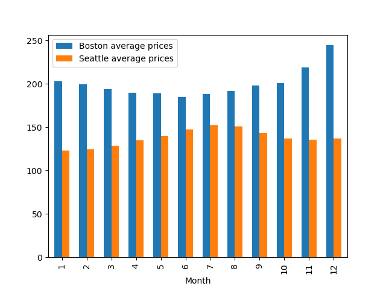
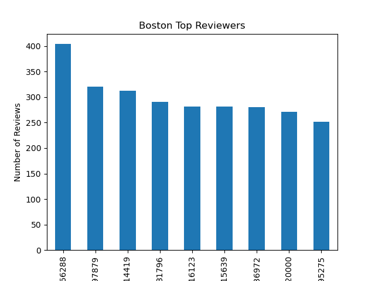
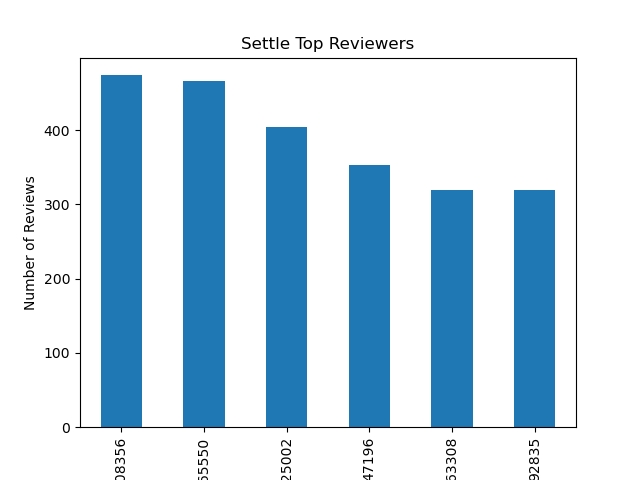
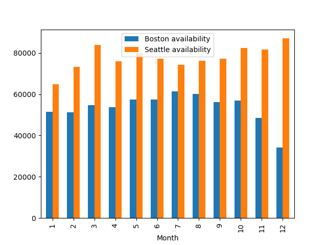

Data Science Blog: Airbnb Analysis of Boston and Seattle

Airbnb has transformed how people travel, offering unique and personalized accommodations globally. As part of a data science project, I compared two popular travel destinations—Boston and Seattle—to understand how various factors influence accommodation prices and availability. By analyzing datasets from Kaggle, this project provides insights into the dynamics of Airbnb listings in these two cities.

Key Questions Addressed

I explored the following key questions:

How do the month and location impact booking prices?
This analysis investigates how seasonal changes and geographical differences affect the cost of accommodations in Boston and Seattle.

Which apartments receive the most reviews?
I identified the most popular properties in both cities based on the number of reviews, providing insights into customer preferences.

How does availability vary based on location and month?
I analyzed trends in availability throughout the year and compared them between the two cities.

Datasets

The datasets used for this analysis provide a comprehensive view of Airbnb activity in both cities, including:

Listing details: Information about the properties, such as price, number of reviews, availability, and location.
Calendar data: Daily availability and pricing information for each listing.
Reviews: Detailed feedback from guests, including unique reviewer IDs and comments.
The analysis primarily relied on two files from each city:

Calendar.csv: For daily pricing and availability.
<a href="https://github.com/sknevhal/data-science-blog_udacity/main/dataset/boston/calender.csv" download> boston/calendar.csv </a>

<a href="https://github.com/sknevhal/data-science-blog_udacity/main/dataset/seattle/calender.csv" download> seattle/calendar.csv </a>

Reviews.csv: For insights into property popularity based on review counts.
<a href="https://github.com/sknevhal/data-science-blog_udacity/main/dataset/boston/reviews.csv" download> boston/reviews.csv </a>

<a href="https://github.com/sknevhal/data-science-blog_udacity/main/dataset/seattle/reviews.csv" download> seattle/reviews.csv </a>

Data Preparation and Analysis

Price Analysis by Month and Location

The first step was to prepare the data for analysis. I converted the price data from its string format (e.g., "$85.00") to a numeric format, making it easier to analyze. Additionally, I extracted the month from each date to explore seasonal price trends.

After processing the data, I calculated the average price per month for both Boston and Seattle and visualized the results in a bar chart.

Insights:

Seattle accommodations are generally more affordable than those in Boston, with a price difference of at least $50.
In Seattle, July and August are the most expensive months for accommodation, while Boston experiences peak prices in September and October.
Review Count Analysis

Next, I focused on identifying the properties with the highest number of reviews in each city. I filtered the data to highlight listings with review counts exceeding a certain threshold and visualized the top reviewers in bar charts.

Insights:

The properties with the most reviews tend to be the most popular among guests. This trend is consistent across both cities, indicating that customer feedback significantly influences a listing's success.
Availability Trends

Finally, I examined the availability trends across the year. By focusing on entries where availability was marked as true, I compared the overall availability in both cities.

Insights:

Seattle generally shows higher availability compared to Boston. Boston, on the other hand, experiences a significant drop in availability during its peak pricing months, especially in September and October.
Conclusion

This analysis highlights the importance of timing and location in planning travel accommodations. By understanding how prices fluctuate throughout the year and identifying popular properties, travelers can make more informed decisions and potentially save on accommodation costs. Moreover, the analysis shows that properties with more reviews tend to attract more bookings, offering valuable insights for both travelers and hosts.

This project not only sheds light on the Airbnb market dynamics in Boston and Seattle but also provides a framework for analyzing similar datasets in other cities.
